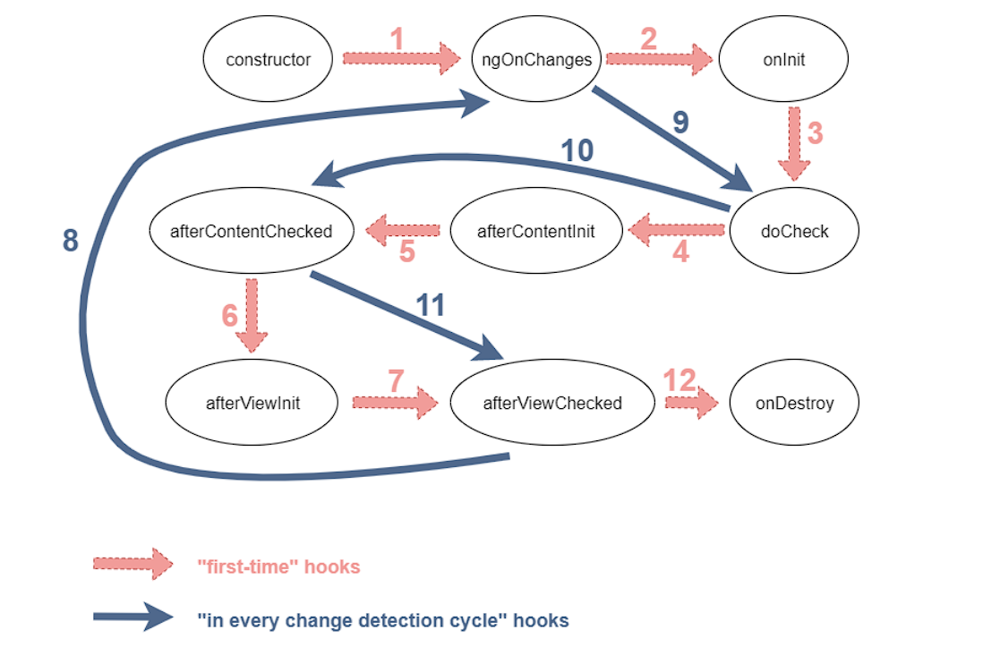

# LearnAngular

## Angular Life cycle

### OnInit
`` ngOnChanges > ngOnInit ``
- Called once, after the first ngOnChanges(). ngOnInit() is still called even when ngOnChanges() is not (which is the case when there are no template-bound inputs).
- Initialize the directive or component after Angular first displays the data-bound properties and sets the directive or component's input properties. See details in Initializing a component or directive in this document.

### ngOnChanges
`` ngOnChanges > ngOnInit ``
- Called before ngOnInit() (if the component has bound inputs) and whenever one or more data-bound input properties change.
- Respond when Angular sets or resets data-bound input properties. The method receives a SimpleChanges object of current and previous property values.

### ngDoCheck
`` ngOnchanges > ngOnInit > ngDoCheck  ``
- Called immediately after ngOnChanges() on every change detection run, and immediately after ngOnInit() on the first run.
- Detect and act upon changes that Angular can't or won't detect on its own. See details and example in Defining custom change detection in this document

### ngAfterContentInit
`` ngOnchanges > ngOnInit > ngDoCheck > ngAfterContentInit ``
- Called **once** after the **first** ngDoCheck().
- Respond after Angular projects external content into the component's view, or into the view that a directive is in.

### ngAfterContentChecked
`` ngOnchanges > ngOnInit > ngDoCheck > ngAfterContentInit > ngAfterContentChecked ``
- Called after ngAfterContentInit() and **every** subsequent ngDoCheck().
- Respond after Angular checks the content projected into the directive or component.

### ngAfterViewInit
`` ngOnchanges > ngOnInit > ngDoCheck > ngAfterContentInit > ngAfterContentChecked > ngAfterViewInit``
- Called **once** after the **first** ngAfterContentChecked().
- Respond after Angular initializes the component's views and child views, or the view that contains the directive.

### ngViewChecked
`` ngOnchanges > ngOnInit > ngDoCheck > ngAfterContentInit > ngAfterContentChecked > ngAfterViewInit > ngViewcheck``
- Called after the ngAfterViewInit() and **every** subsequent ngAfterContentChecked().
- Respond after Angular checks the component's views and child views, or the view that contains the directive.

### ngOnDestroy
`` ngOnchanges > ngOnInit > ngDoCheck > ngAfterContentInit > ngAfterContentChecked > ngAfterViewInit > ngViewcheck > ngOnDestroy``
- Called immediately before Angular destroys the directive or component.
- Cleanup just before Angular destroys the directive or component. Unsubscribe Observables and detach event handlers to avoid memory leaks.

