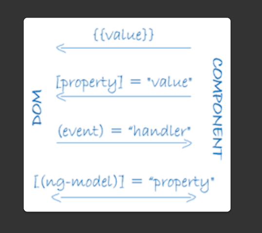

# LearnAngular

- @ - Decorator: These decorators mark their type and provide metadata that tells Angular how to use them.
    - The metadata for a component class associates it with a template that defines a view. A template combines ordinary HTML with Angular directives and binding markup that allow Angular to modify the HTML before rendering it for display.
    - The metadata for a service class provides the information Angular needs to make it available to components through dependency injection (DI)
- main.ts: Typescript module 
- @NgModule: 
- The @Component() decorator identifies the class immediately below it as a component, and provides the template and related component-specific metadata.
- A service class definition is immediately preceded by the @Injectable() decorator.
- https://angular.io/guide/glossary
- Binding 

    

    